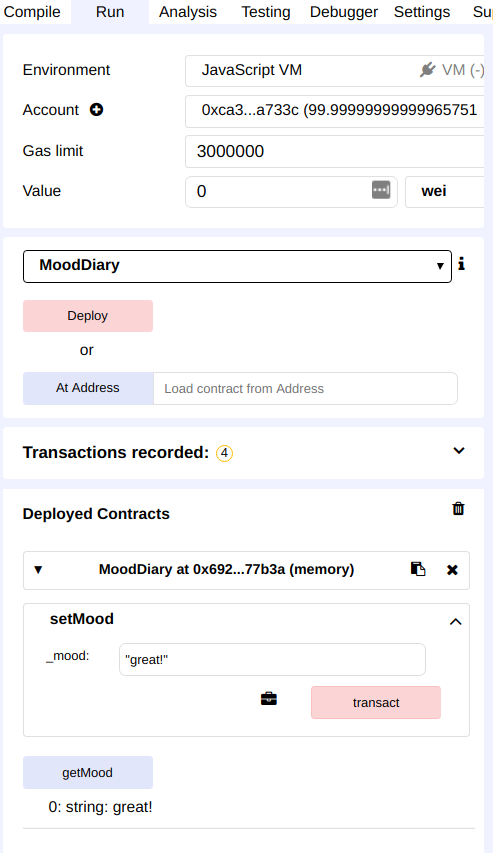

# Create An Ethereum Dapp with Ethersjs

 This is a step-by-step tutorial on how to create a front end, deploy a Solidity smart contract, and connect them together.
 We will use [Metamask](https://metamask.io), [Remix IDE](https://remix.ethereum.org) and [Ethersjs](https://github.com/ethers-io/ethers.js/). 
 
 By the end of this tutorial you will be able to create a simple HTML front end with buttons that can interact with smart contract functions. The tutorial takes place in 3 stages
 
 - Create a basic html web page
 - Create a basic solidity smart contract
 - Connect the web page with the smart contracts using Ethersjs.  

---

### Preparation
 
1. **Download and Install [MetaMask](https://metamask.io)**
   1. Never used Metamask? Watch [this explainer video](https://youtu.be/wlm4QcA8c4Q?t=66)
   
       *The important bits for us are: `1:06 to 4:14`*
   2. Change to the Ropsten Tesnet and get a Copy an account's wallet public address   
   
<p align="middle">
  &nbsp;&nbsp;&nbsp;&nbsp;&nbsp;  

</p>


2. **Request some Ropsten Tesnet Ether from a faucet loaded into your Metamask Wallet.**
     1. Never done a metamask transaction? Watch [this explainer video](https://youtu.be/wlm4QcA8c4Q?t=66)
     2. [Blog explaining a faucet and how to use one](https://blog.b9lab.com/when-we-first-built-our-faucet-we-deployed-it-on-the-morden-testnet-70bfbf4e317e)
     3. [Faucet link to request funds](https://ipfs.io/ipfs/QmVAwVKys271P5EQyEfVSxm7BJDKWt42A2gHvNmxLjZMps/)
     
     
3. **Install a http server. Use any you like, but we recommend a simple python instance for beginners:**
   1. Install NPM ([Download and Instructions](https://www.npmjs.com/)) 
   2. Install python (version 3) (with NPM in a terminal/command prompt): 
   
    ```bash
    npm install python -g
    npm install http-server -g
    ```
 
---

### Create and Serve a Simple Webpage

The first step is to create a basic html page.
  
 - Create a new directory in your terminal using `mkdir <directory name>`
 - Create a new file called `index.html` by : `touch index.html`
 - In your favourite code editor, open the file (ex: `atom index.html' )
 - Open <html> and <body> tags inside the html page and add some buttons. [Here is an example](index.html)
 
 - Serve the webpage via terminal/command prompt from the directory that has `index.html` in it: 
   ```bash
   python -m http.server 1337
   ```
 - Go to [http://127.0.0.1:1337/](http://127.0.0.1:1337/) in your browser to see your page!
 

---

### Create a Basic Smart Contract

1. You can use any editor you like to make the contract, but we highly recomend the online IDE [remix.ethereum.org]
   - Never used remix before? Checkout [This video](https://www.youtube.com/watch?v=pdJttvcAV1c)
2. Create a solidity file `<name>.sol` with a minimum of a set and get function. [Something like this](contracts/mood.sol)
3. Deploy the contract on the Ropsten Testnet.
   1. Copy your code into the Remix editor
   2. Compile (and debuf) the code. _Note that it may take a moment to load the compiler_
   3. **(OPTIONAL)** Under the Run tab (top right) Set your Enviroment to `JavaVM` (your own personal ethereum on your machine). Otherwise use the Ropsten testnet by setting `Injected Web3`
   3. Deploy the contract under the Run tab
   4. Under Deployed Contracts, test out your functions on the Remix Run tab to make sure your contract works as expected!

<p align="middle">

</p>

***Be sure to deploy on Roposen via Remix under the `Injected Web3` enviroment and confrim the deploy transaction in Metamask***

Make a new temporary file to hold: 
   - The deployed contract's address
      - Copy it via the copy button next to the deployed contracts pulldown in remix's **Run** tab 
   - The contract ABI ([what is that?](https://solidity.readthedocs.io/en/develop/abi-spec.html)) 
      - Copy it via the copy button under to the contract in remix's **Compile** tab (also in Details) 

---

### Connect Your Webpage to Your Smart Contract

Back in your local text editor in `index.html`, add the following code to your html page:

1. Import the Ethersjs source into your `index.html` page inside a new set of script tags:

```html
<script charset="utf-8"
        src="https://cdn.ethers.io/scripts/ethers-v4.min.js"
        type="text/javascript">
 
 //ADD YOUR CODE HERE
 
</script>
```


2. Define an ethers provider. In our case it is Ropsten:

```javascript
var provider = new ethers.providers.Web3Provider(web3.currentProvider,'ropsten');
```

3. Import the contract ABI ([what is that?](https://solidity.readthedocs.io/en/develop/abi-spec.html)) and specify the contract address on our provider's blockchain:

```javascript
  var MoodContractAddress = "<contract address>";
  var MoodContractABI = <contract ABI>
  var MoodContract
  var signer
```

4. Connect the signer to your metamask account (we use `[0]` as the defalut), and define the contract object using your contract address, ABI, and signer.

```javascript
provider.listAccounts().then(function(accounts) {
      signer = provider.getSigner(accounts[0]);
      MoodContract = new ethers.Contract(MoodContractAddress, MoodContractABI, signer);
    })
```

5. Create asynchronous functions to call your smart contract functions

```javascript
  async function getMood(){
    getMoodPromise = MoodContract.getMood();
    var Mood = await getMoodPromise;
    console.log(Mood);
  }

  async function setMood(){
    setMoodPromise = MoodContract.setMood("patient");
    await setMoodPromise;
  }
```

6. Connect your functions to your html buttons

```html

<button onclick="getMood()"> get Mood </button>
<button onclick = "setMood()"> set Mood</button>
```

---

### Test Your Work Out!

1. Got your webserver up? Go to [http://127.0.0.1:1337/](http://127.0.0.1:1337/) in your browser to see your page! 
2. Test your functions and approve the transactions as needed through Metamask. Note block times are ~15 seconds... so wait a bit to read the state of the blockchain :sunglasses:
3. See your contract and transaction info via [https://ropsten.etherscan.io/] 
4. Open a console (`Ctrl + Shift + i`) in the browser to see see the magic happen as you press those buttons :stars:
 
---

### :tada::confetti_ball::tada::confetti_ball::tada: DONE! :tada::confetti_ball::tada::confetti_ball::tada:
Celebrate! :bowtie: You just made a webpage that interacted with _a real live Ethereum testnet on the internet_! That is not something many folks can say they have done! :rocket:

---
### Optional - Try to interact with another contract!

#### Try and use the following information to interact with an existing contract we published on the Roptsen testnet: 

- We have a `MoodDiary` contract instance created [at this transaction](https://ropsten.etherscan.io/tx/0x8da093fdc4ae3e1b469dfff97b414a9800c9fdd8c1c897b6b746faf43aa3b7f8)


- Here is the contract ([on etherscan](https://ropsten.etherscan.io/address/0xc5afd2d92750612a9619db2282d9037c58fc22cb))
  - We also verified our source code to [ropsten.etherscan.io](https://ropsten.etherscan.io/address/0xc5afd2d92750612a9619db2282d9037c58fc22cb#code) as an added measure for you to verify what the contract is exactly, and also the ABI is available to _the world_! :grin:


- The ABI is also in [this file](./Mood_ABI.json)


#### This illustrates an important point: you can also build a dApp _without needing to write the Ethereum contract yourself_! If you want to use an existing contract written and already on Ethereum! 
